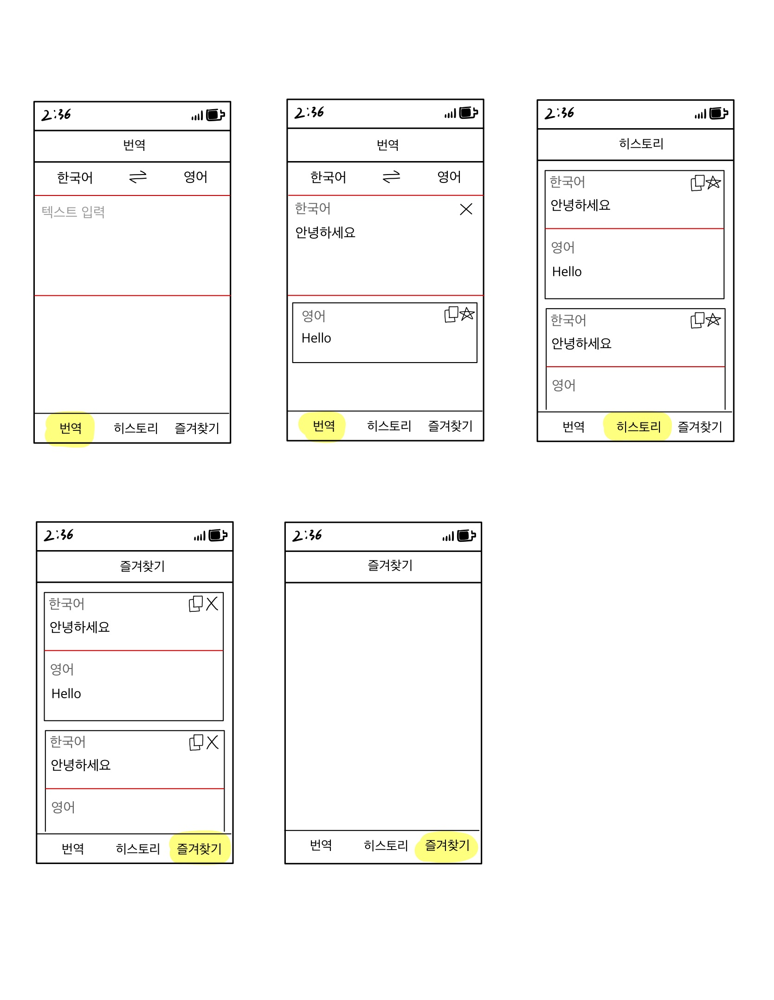
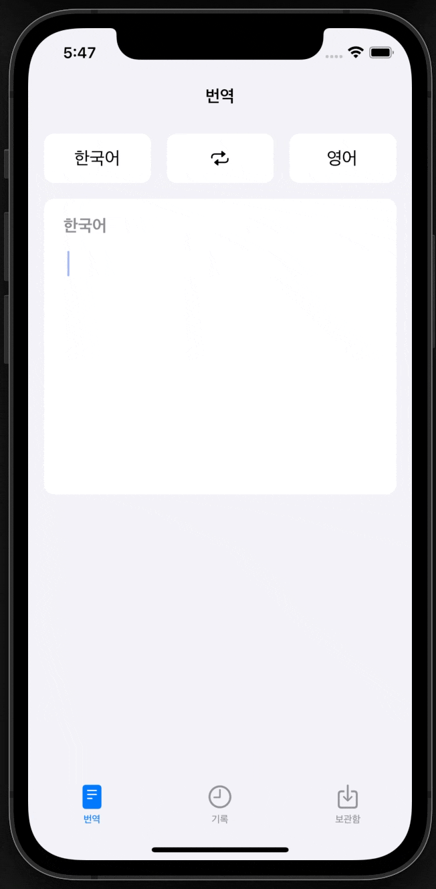
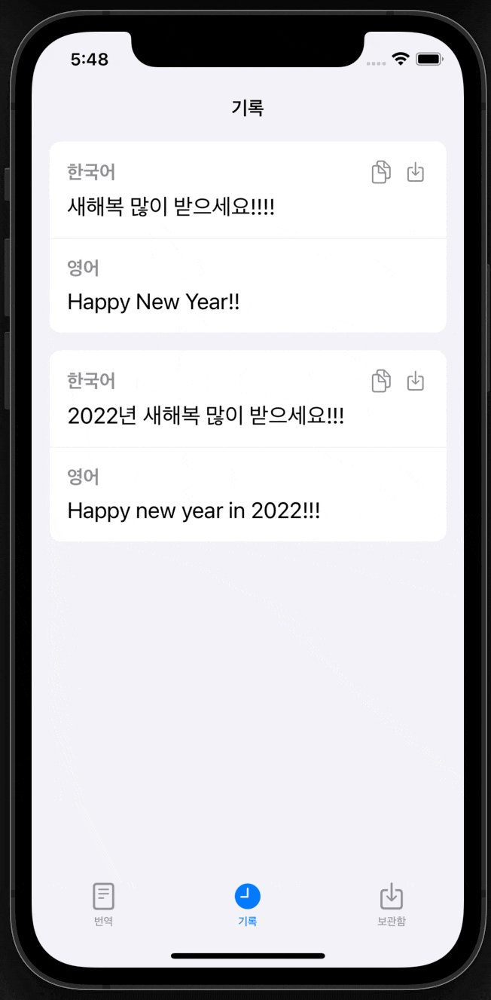
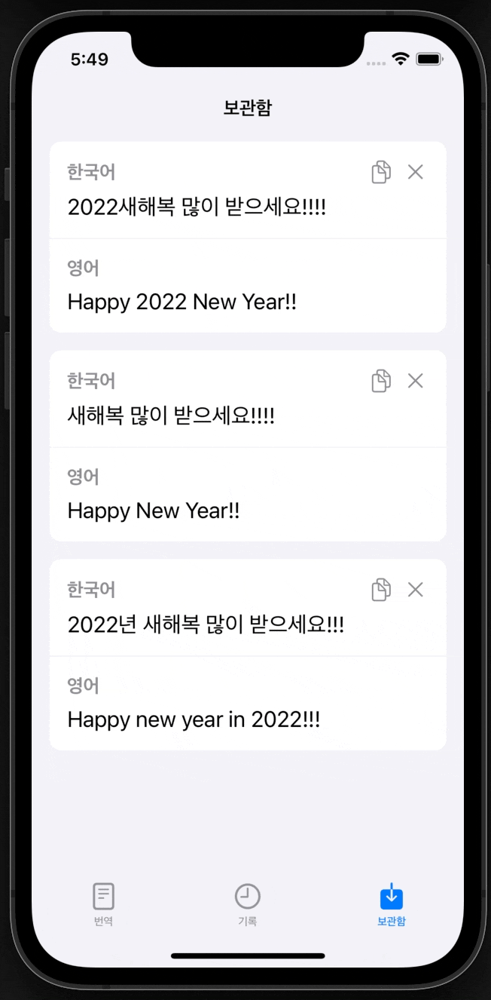

# TranstorKing
Unsplash API를 활용하여, iOS Unsplash 앱을 따라 개발한 프로젝트 입니다. 
개발에 대한 내용은 다음 블로그에 기록하고 있습니다. 
https://skillist.tistory.com/category/iOS%20%EA%B0%9C%EB%B0%9C/%EB%B2%88%EC%97%AD%EA%B8%B0%20%EC%95%B1%28RxSwift%29 
  

# 🖼 ScreenShots

|기획서|
|:---:|
||

  

|번역 화면|
|:---:|
||

  

|기록 화면|
|:---:|
||

  

|보관함 화면|
|:---:|
||

  

# 🗒 OpenSource

|OpenSource|
|:---:|
|RxSwift|
|RxCocoa|
|RxDataSources|
|SnapKit|
|SwiftLint|
|Alamofire|

 

* RxSwift (https://github.com/ReactiveX/RxSwift) - MIT license 
* RxCocoa (https://github.com/ReactiveX/RxSwift) - MIT license 
* RxDataSources (https://github.com/RxSwiftCommunity/RxDataSources) - MIT license 
* SnapKit (https://github.com/SnapKit/SnapKit) - MIT license 
* SwiftLint (https://cocoapods.org/pods/SwiftLint) - MIT license 
* Alamofire (https://cocoapods.org/pods/Alamofire) - MIT license 

  

# 📝 사용
Naver의 Papago 번역 API를 사용하고 있어, Naver의 Papago API의 Key가 필요합니다. 
TranslateAPI.swift 파일의 24,25라인에 본인의 API Key를 입력하세요. 
https://developers.naver.com/products/papago/nmt/nmt.md 
  

# ❗️ 버그 및 피드백
버그나 수정사항, 피드백 등에 대하여 연락이 필요한 경우 블로그로 연락 부탁드립니다. 감사합니다. 
https://skillist.tistory.com/category/iOS%20%EA%B0%9C%EB%B0%9C/%EB%B2%88%EC%97%AD%EA%B8%B0%20%EC%95%B1%28RxSwift%29
  
